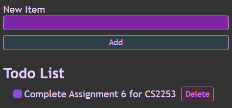

# To Do List Program

## 1. Which package/library does the sample program demonstrate?

This sample program demonstrates the use of the following JavaScript library:
- React: This library has the capability to build user interfaces out of individual pieces called components which can be combined into entire screens, pages, and apps.[ref](https://react.dev/)
The main focus of the program is to demonstrate the user interface creation capability of the React library.

## 2. How does someone run your program?

To run the program, follow these steps:

1. Copy the link to the GitHub repository.
2. Create a local folder and open a terminal in that directory.
3. Clone the copied repository:
```
git clone {the url to the GitHub repo}
```
4. Open the folder in Visual Studio Code. Make sure you ```cd``` into the cloned folder.
5. ```npm install```
6. ```npm start```
7. The project webpage should open up.

## 3. What purpose does your program serve?

The program creates a simple and easy to use to do list which can be utilized to add any number of tasks, check them off once completed and then delete them to clear up the list.

## 4. What would be some sample input/output?

### Sample Input:

Add a few tasks by typing in the ```New Item``` box and clicking the ```Add``` button as shown below:


### Sample Output:



